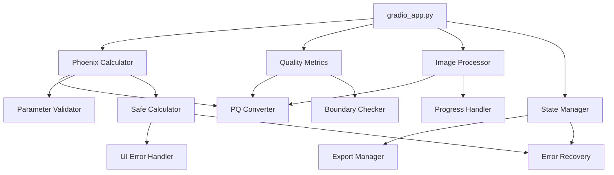
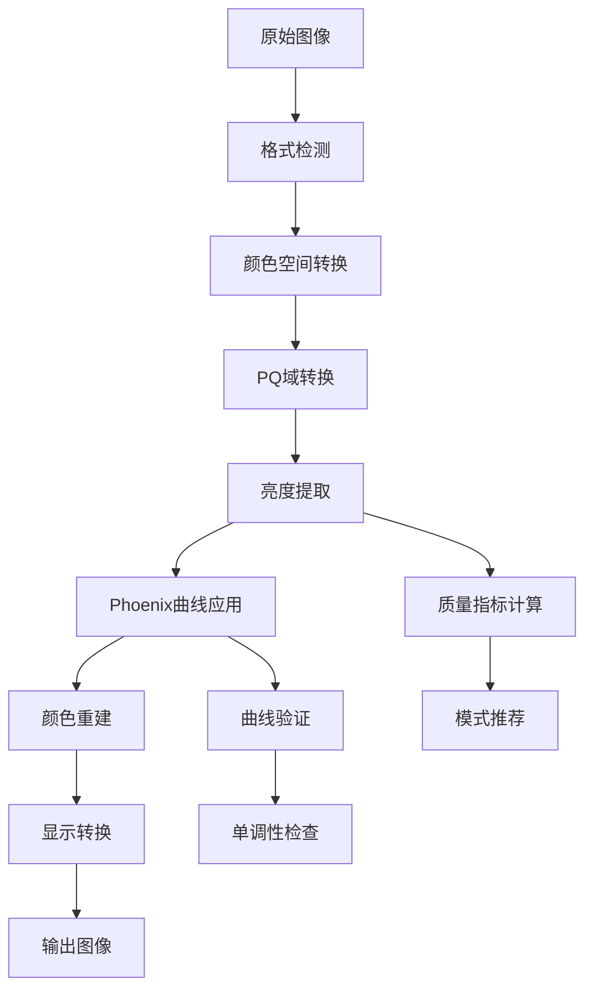
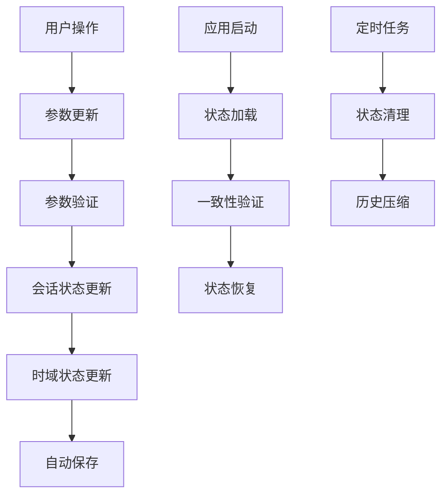
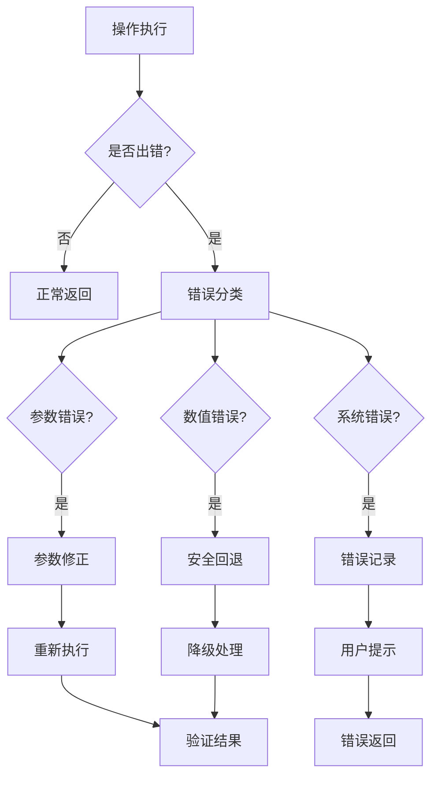

# HDR色调映射专利可视化工具 - 开发者文档

## 目录
1. [项目架构](#项目架构)
2. [核心算法](#核心算法)
3. [模块设计](#模块设计)
4. [数据流程](#数据流程)
5. [扩展开发](#扩展开发)
6. [测试框架](#测试框架)
7. [性能优化](#性能优化)
8. [维护指南](#维护指南)

## 项目架构

### 整体架构

```
HDR色调映射专利可视化工具
├── 用户界面层 (Gradio)
│   ├── 参数控制面板
│   ├── 实时曲线可视化
│   ├── 图像处理界面
│   └── 状态监控面板
├── 业务逻辑层
│   ├── Phoenix曲线计算
│   ├── 质量指标评估
│   ├── 图像处理管线
│   └── 状态管理
├── 核心算法层
│   ├── PQ域转换
│   ├── 数值计算
│   ├── 参数验证
│   └── 错误处理
└── 数据存储层
    ├── 会话状态持久化
    ├── 时域状态管理
    └── 导出数据格式
```

### 模块依赖关系



### 文件结构

```
src/
├── core/                          # 核心模块
│   ├── __init__.py               # 模块导出
│   ├── phoenix_calculator.py     # Phoenix曲线计算
│   ├── quality_metrics.py        # 质量指标计算
│   ├── image_processor.py        # 图像处理
│   ├── pq_converter.py          # PQ域转换
│   ├── state_manager.py         # 状态管理
│   ├── export_manager.py        # 导出管理
│   ├── auto_mode_estimator.py   # 自动模式估算
│   ├── temporal_smoothing.py    # 时域平滑
│   ├── spline_calculator.py     # 样条曲线
│   ├── parameter_validator.py   # 参数验证
│   ├── safe_calculator.py       # 安全计算
│   ├── boundary_checker.py      # 边界检查
│   ├── error_recovery.py        # 错误恢复
│   ├── ui_error_handler.py      # UI错误处理
│   ├── performance_monitor.py   # 性能监控
│   └── progress_handler.py      # 进度处理
├── gradio_app.py                # Gradio用户界面
└── main.py                      # 命令行演示

tests/                           # 测试模块
├── test_*.py                    # 单元测试
├── test_integration_final.py    # 集成测试
├── test_validation_framework.py # 验证框架
└── run_validation_tests.py     # 测试运行器

examples/                        # 示例代码
├── *.py                        # 功能演示
└── outputs/                    # 输出文件

docs/                           # 文档
├── USER_MANUAL.md              # 用户手册
├── API_DOCUMENTATION.md        # API文档
└── DEVELOPER_DOCUMENTATION.md  # 开发者文档
```

## 核心算法

### Phoenix曲线算法

Phoenix曲线是本工具的核心色调映射算法，基于专利技术实现。

#### 数学公式

```
L' = L^p / (L^p + a^p)
```

其中：
- `L`: 输入亮度（PQ域，范围0-1）
- `L'`: 输出亮度（PQ域，范围0-1）
- `p`: 亮度控制因子（范围0.1-6.0）
- `a`: 缩放因子（范围0.0-1.0）

#### 实现细节

```python
def compute_phoenix_curve(self, L: np.ndarray, p: float, a: float) -> np.ndarray:
    """
    Phoenix曲线计算的核心实现
    
    关键技术点：
    1. 数值稳定性处理
    2. 边界条件检查
    3. 单调性保证
    4. 端点归一化
    """
    
    # 输入验证
    L = np.asarray(L, dtype=np.float64)
    if not (0.1 <= p <= 6.0):
        raise ValueError(f"参数p={p}超出范围[0.1, 6.0]")
    if not (0.0 <= a <= 1.0):
        raise ValueError(f"参数a={a}超出范围[0.0, 1.0]")
    
    # 数值稳定性处理
    L_safe = np.clip(L, self.eps, 1.0 - self.eps)
    
    # Phoenix公式计算
    if a < self.eps:
        # a≈0时的特殊处理，避免除零
        L_out = np.power(L_safe, p - 1.0)
    else:
        # 标准Phoenix公式
        L_p = np.power(L_safe, p)
        a_p = np.power(a, p)
        L_out = L_p / (L_p + a_p)
    
    # 端点处理
    L_out[L <= self.eps] = 0.0
    L_out[L >= 1.0 - self.eps] = 1.0
    
    return L_out
```

#### 单调性验证

```python
def validate_monotonicity(self, L_out: np.ndarray) -> bool:
    """
    验证曲线单调性
    
    使用高密度采样（≥1024点）确保准确性
    """
    if len(L_out) < 2:
        return True
    
    # 计算差分
    diff = np.diff(L_out)
    
    # 允许数值误差
    tolerance = 1e-12
    
    # 检查是否严格单调递增
    return np.all(diff >= -tolerance)
```

### PQ域转换算法

基于ITU-R BT.2100标准的ST 2084 (PQ)转换。

#### 转换公式

**线性光 → PQ域**:
```
PQ = ((c1 + c2 * Y^m1) / (1 + c3 * Y^m1))^m2
```

**PQ域 → 线性光**:
```
Y = ((max(PQ^(1/m2) - c1, 0) / (c2 - c3 * PQ^(1/m2)))^(1/m1)) * 10000
```

其中常数：
- c1 = 0.8359375 = 3424/4096
- c2 = 18.8515625 = 2413/128  
- c3 = 18.6875 = 2392/128
- m1 = 0.1593017578125 = 2610/16384
- m2 = 78.84375 = 2523/32

#### 实现优化

```python
class PQConverter:
    def __init__(self):
        # ST 2084 PQ常数（预计算优化）
        self.m1 = 2610.0 / 16384.0
        self.m2 = 2523.0 / 32.0
        self.c1 = 3424.0 / 4096.0
        self.c2 = 2413.0 / 128.0
        self.c3 = 2392.0 / 128.0
        
        # 数值稳定性参数
        self.eps = 1e-10
        self.max_nits = 10000.0
    
    def linear_to_pq(self, L: np.ndarray) -> np.ndarray:
        """线性光转PQ域（优化版本）"""
        L = np.asarray(L, dtype=np.float64)
        
        # 归一化到[0,1]范围
        Y = np.clip(L / self.max_nits, 0.0, 1.0)
        
        # 避免数值问题
        Y = np.maximum(Y, self.eps)
        
        # PQ转换
        Y_m1 = np.power(Y, self.m1)
        numerator = self.c1 + self.c2 * Y_m1
        denominator = 1.0 + self.c3 * Y_m1
        
        pq = np.power(numerator / denominator, self.m2)
        
        return np.clip(pq, 0.0, 1.0)
```

### 质量指标算法

#### 感知失真计算

基于PQ域方差变化的感知失真度量：

```python
def compute_perceptual_distortion(self, L_in: np.ndarray, L_out: np.ndarray) -> float:
    """
    计算感知失真 D'
    
    公式: D' = |Var(L_out) - Var(L_in)| / (Var(L_in) + ε)
    """
    L_in = np.asarray(L_in, dtype=np.float64)
    L_out = np.asarray(L_out, dtype=np.float64)
    
    # 计算方差
    var_in = np.var(L_in)
    var_out = np.var(L_out)
    
    # 感知失真
    distortion = abs(var_out - var_in) / (var_in + self.eps)
    
    return float(distortion)
```

#### 局部对比度计算

```python
def compute_local_contrast(self, L: np.ndarray) -> float:
    """
    计算局部对比度
    
    1D: 相邻差分的平均值
    2D: 梯度幅值的平均值
    """
    L_array = np.asarray(L, dtype=np.float64)
    
    if L_array.ndim == 1:
        if len(L_array) < 2:
            return 0.0
        diff = np.abs(np.diff(L_array))
        return float(np.mean(diff))
    
    elif L_array.ndim == 2:
        # 计算梯度
        grad_x = np.abs(np.diff(L_array, axis=1))
        grad_y = np.abs(np.diff(L_array, axis=0))
        
        contrast_x = np.mean(grad_x) if grad_x.size > 0 else 0.0
        contrast_y = np.mean(grad_y) if grad_y.size > 0 else 0.0
        
        return float((contrast_x + contrast_y) / 2.0)
    
    else:
        raise ValueError(f"不支持的数组维度: {L_array.ndim}")
```

#### 滞回模式推荐

```python
def recommend_mode_with_hysteresis(self, distortion: float) -> str:
    """
    带滞回特性的模式推荐
    
    滞回逻辑：
    - D' ≤ dt_low: 自动模式
    - D' ≥ dt_high: 艺术模式  
    - dt_low < D' < dt_high: 保持上次决策
    """
    if distortion <= self.dt_low:
        self.last_recommendation = "自动模式"
    elif distortion >= self.dt_high:
        self.last_recommendation = "艺术模式"
    # 中间区间保持上次决策
    
    return self.last_recommendation or "艺术模式"
```

## 模块设计

### 状态管理设计

#### 分离存储架构

```python
class StateManager:
    """
    状态管理器 - 实现会话状态和时域状态的分离存储
    
    设计原则：
    1. 会话状态：用户界面参数，持久化存储
    2. 时域状态：历史参数变化，临时存储
    3. 状态一致性：加载时验证数据完整性
    4. 自动保存：参数变化时自动保存
    """
    
    def __init__(self, state_dir: str = ".kiro_state"):
        self.state_dir = Path(state_dir)
        self.state_dir.mkdir(exist_ok=True)
        
        # 分离的状态文件
        self.session_file = self.state_dir / "session_state.json"
        self.temporal_file = self.state_dir / "temporal_state.json"
        
        # 状态对象
        self._session_state = SessionState()
        self._temporal_state = TemporalStateData()
        
        # 自动保存配置
        self.auto_save = True
        self.save_interval = 30  # 秒
```

#### 状态数据结构

```python
@dataclass
class SessionState:
    """会话状态数据结构"""
    # Phoenix参数
    p: float = 2.0
    a: float = 0.5
    
    # 工作模式
    mode: str = "艺术模式"
    
    # 质量指标参数
    dt_low: float = 0.05
    dt_high: float = 0.10
    luminance_channel: str = "MaxRGB"
    
    # 样条参数
    enable_spline: bool = False
    th1: float = 0.2
    th2: float = 0.5
    th3: float = 0.8
    th_strength: float = 0.0
    
    # 时域平滑参数
    window_size: int = 9
    lambda_smooth: float = 0.3
    
    # 元数据
    last_updated: str = ""
    version: str = "1.0"
    
    def to_dict(self) -> Dict[str, Any]:
        """转换为字典（用于JSON序列化）"""
        return asdict(self)
    
    @classmethod
    def from_dict(cls, data: Dict[str, Any]) -> 'SessionState':
        """从字典创建实例"""
        return cls(**data)

@dataclass
class TemporalStateData:
    """时域状态数据结构"""
    current_frame: int = 0
    parameter_history: List[Dict[str, float]] = field(default_factory=list)
    distortion_history: List[float] = field(default_factory=list)
    timestamp_history: List[str] = field(default_factory=list)
    
    # 统计信息
    variance_reduction: float = 0.0
    smoothing_active: bool = False
    
    # 配置
    max_history_length: int = 100
    
    def add_frame(self, parameters: Dict[str, float], 
                  distortion: float, timestamp: str):
        """添加新帧数据"""
        self.parameter_history.append(parameters.copy())
        self.distortion_history.append(distortion)
        self.timestamp_history.append(timestamp)
        self.current_frame += 1
        
        # 限制历史长度
        if len(self.parameter_history) > self.max_history_length:
            self.parameter_history.pop(0)
            self.distortion_history.pop(0)
            self.timestamp_history.pop(0)
```

### 错误处理设计

#### 多层错误处理架构

```python
class ErrorHandlingSystem:
    """
    多层错误处理系统
    
    层次结构：
    1. UI错误处理：用户友好的错误提示
    2. 业务逻辑错误：参数验证和边界检查
    3. 系统错误：数值计算和资源错误
    4. 自动恢复：错误后的自动修复
    """
    
    def __init__(self):
        self.ui_error_handler = UIErrorHandler()
        self.boundary_checker = BoundaryChecker()
        self.error_recovery = ErrorRecoverySystem()
        self.safe_calculator = SafeCalculator()
```

#### 安全计算器

```python
class SafeCalculator:
    """
    安全计算器 - 提供带错误处理的计算接口
    """
    
    def safe_phoenix_calculation(self, L: np.ndarray, p: float, a: float) -> Tuple[np.ndarray, bool, str]:
        """
        安全的Phoenix曲线计算
        
        Returns:
            (结果数组, 是否成功, 状态消息)
        """
        try:
            # 参数验证
            is_valid, error_msg = self.validator.validate_phoenix_params(p, a)
            if not is_valid:
                return np.zeros_like(L), False, error_msg
            
            # 边界检查
            violations = self.boundary_checker.check_phoenix_boundaries(p, a)
            if violations:
                # 尝试参数修正
                corrected_p, corrected_a = self.error_recovery.correct_parameters(p, a, violations)
                p, a = corrected_p, corrected_a
            
            # 执行计算
            result = self.phoenix_calc.compute_phoenix_curve(L, p, a)
            
            # 结果验证
            if not np.all(np.isfinite(result)):
                return np.zeros_like(L), False, "计算结果包含非有限值"
            
            # 单调性检查
            if not self.phoenix_calc.validate_monotonicity(result):
                return np.zeros_like(L), False, "计算结果非单调"
            
            return result, True, "计算成功"
            
        except Exception as e:
            self.error_recovery.log_error("phoenix_calculation", str(e))
            return np.zeros_like(L), False, f"计算异常: {str(e)}"
```

### 性能监控设计

#### 性能监控器

```python
class PerformanceMonitor:
    """
    性能监控器 - 监控系统性能和资源使用
    """
    
    def __init__(self):
        self.operation_times = {}
        self.resource_usage = {}
        self.acceleration_info = self._detect_acceleration()
    
    @contextmanager
    def measure_operation(self, operation_name: str):
        """测量操作执行时间"""
        start_time = time.time()
        start_memory = self._get_memory_usage()
        
        try:
            yield
        finally:
            end_time = time.time()
            end_memory = self._get_memory_usage()
            
            duration = end_time - start_time
            memory_delta = end_memory - start_memory
            
            if operation_name not in self.operation_times:
                self.operation_times[operation_name] = []
            
            self.operation_times[operation_name].append({
                'duration': duration,
                'memory_delta': memory_delta,
                'timestamp': time.time()
            })
    
    def get_performance_summary(self) -> Dict[str, Any]:
        """获取性能摘要"""
        summary = {}
        
        for op_name, measurements in self.operation_times.items():
            durations = [m['duration'] for m in measurements]
            memory_deltas = [m['memory_delta'] for m in measurements]
            
            summary[op_name] = {
                'count': len(measurements),
                'avg_duration': np.mean(durations),
                'max_duration': np.max(durations),
                'min_duration': np.min(durations),
                'avg_memory_delta': np.mean(memory_deltas),
                'total_duration': np.sum(durations)
            }
        
        return summary
```

## 数据流程

### 图像处理流程



### 状态管理流程



### 错误处理流程



## 扩展开发

### 添加新的色调映射算法

1. **定义算法接口**

```python
from abc import ABC, abstractmethod

class ToneMappingOperator(ABC):
    """色调映射算子基类"""
    
    @abstractmethod
    def compute_curve(self, L: np.ndarray, **params) -> np.ndarray:
        """计算色调映射曲线"""
        pass
    
    @abstractmethod
    def get_parameter_ranges(self) -> Dict[str, Tuple[float, float]]:
        """获取参数范围"""
        pass
    
    @abstractmethod
    def validate_parameters(self, **params) -> Tuple[bool, str]:
        """验证参数有效性"""
        pass
```

2. **实现具体算法**

```python
class ReinhardOperator(ToneMappingOperator):
    """Reinhard色调映射算子"""
    
    def compute_curve(self, L: np.ndarray, **params) -> np.ndarray:
        """
        Reinhard公式: L' = L / (1 + L)
        """
        L = np.asarray(L, dtype=np.float64)
        alpha = params.get('alpha', 1.0)
        
        return L * alpha / (1.0 + L * alpha)
    
    def get_parameter_ranges(self) -> Dict[str, Tuple[float, float]]:
        return {'alpha': (0.1, 10.0)}
    
    def validate_parameters(self, **params) -> Tuple[bool, str]:
        alpha = params.get('alpha', 1.0)
        if not (0.1 <= alpha <= 10.0):
            return False, f"参数alpha={alpha}超出范围[0.1, 10.0]"
        return True, "参数有效"
```

3. **集成到系统**

```python
class ExtendedPhoenixCalculator(PhoenixCurveCalculator):
    """扩展的Phoenix计算器"""
    
    def __init__(self):
        super().__init__()
        self.operators = {
            'phoenix': self,
            'reinhard': ReinhardOperator()
        }
    
    def compute_curve_with_operator(self, L: np.ndarray, 
                                   operator: str, **params) -> np.ndarray:
        """使用指定算子计算曲线"""
        if operator not in self.operators:
            raise ValueError(f"未知算子: {operator}")
        
        op = self.operators[operator]
        
        # 参数验证
        is_valid, msg = op.validate_parameters(**params)
        if not is_valid:
            raise ValueError(msg)
        
        # 计算曲线
        return op.compute_curve(L, **params)
```

### 添加新的质量指标

```python
class CustomQualityMetric:
    """自定义质量指标"""
    
    def __init__(self, name: str, description: str):
        self.name = name
        self.description = description
    
    def compute(self, L_in: np.ndarray, L_out: np.ndarray) -> float:
        """计算质量指标"""
        # 实现自定义指标计算
        pass
    
    def get_range(self) -> Tuple[float, float]:
        """获取指标值范围"""
        return (0.0, 1.0)
    
    def get_interpretation(self, value: float) -> str:
        """获取指标值解释"""
        if value < 0.3:
            return "优秀"
        elif value < 0.7:
            return "良好"
        else:
            return "需要改进"

# 集成到质量计算器
class ExtendedQualityCalculator(QualityMetricsCalculator):
    def __init__(self):
        super().__init__()
        self.custom_metrics = {}
    
    def add_custom_metric(self, metric: CustomQualityMetric):
        """添加自定义指标"""
        self.custom_metrics[metric.name] = metric
    
    def compute_all_metrics(self, L_in: np.ndarray, L_out: np.ndarray) -> Dict[str, float]:
        """计算所有指标"""
        results = {
            'perceptual_distortion': self.compute_perceptual_distortion(L_in, L_out),
            'local_contrast': self.compute_local_contrast(L_out)
        }
        
        # 计算自定义指标
        for name, metric in self.custom_metrics.items():
            results[name] = metric.compute(L_in, L_out)
        
        return results
```

### 扩展UI界面

```python
class ExtendedGradioInterface(GradioInterface):
    """扩展的Gradio界面"""
    
    def __init__(self):
        super().__init__()
        self.extended_calculator = ExtendedPhoenixCalculator()
        self.extended_quality = ExtendedQualityCalculator()
    
    def create_extended_interface(self):
        """创建扩展界面"""
        with gr.Blocks() as interface:
            # 原有界面
            super().create_interface()
            
            # 扩展功能
            with gr.Tab("扩展功能"):
                self._create_algorithm_selection()
                self._create_custom_metrics_panel()
                self._create_batch_processing_panel()
        
        return interface
    
    def _create_algorithm_selection(self):
        """创建算法选择面板"""
        with gr.Group():
            gr.Markdown("### 色调映射算法选择")
            
            self.algorithm_radio = gr.Radio(
                choices=["Phoenix", "Reinhard", "Drago", "Custom"],
                value="Phoenix",
                label="算法类型"
            )
            
            # 算法特定参数
            with gr.Group():
                self.reinhard_alpha = gr.Slider(
                    minimum=0.1, maximum=10.0, value=1.0,
                    label="Reinhard Alpha", visible=False
                )
            
            # 算法切换事件
            self.algorithm_radio.change(
                fn=self.handle_algorithm_change,
                inputs=[self.algorithm_radio],
                outputs=[self.reinhard_alpha]
            )
```

## 测试框架

### 测试架构

```python
class TestFramework:
    """
    测试框架架构
    
    测试层次：
    1. 单元测试：测试单个函数/方法
    2. 集成测试：测试模块间交互
    3. 系统测试：测试完整工作流程
    4. 性能测试：测试性能基线
    5. 回归测试：防止功能退化
    """
    
    def __init__(self):
        self.unit_tests = UnitTestSuite()
        self.integration_tests = IntegrationTestSuite()
        self.system_tests = SystemTestSuite()
        self.performance_tests = PerformanceTestSuite()
        self.regression_tests = RegressionTestSuite()
```

### 金标测试用例

```python
class GoldenTestCase:
    """金标测试用例"""
    
    def __init__(self, name: str, description: str):
        self.name = name
        self.description = description
        self.test_data = self._generate_test_data()
        self.expected_results = self._compute_expected_results()
    
    def _generate_test_data(self) -> Dict[str, Any]:
        """生成测试数据"""
        return {
            'input_luminance': np.linspace(0, 1, 1000),
            'parameters': {'p': 2.0, 'a': 0.5},
            'test_image': self._create_test_image()
        }
    
    def _compute_expected_results(self) -> Dict[str, Any]:
        """计算期望结果"""
        # 使用参考实现计算期望结果
        pass
    
    def run_test(self, implementation) -> TestResult:
        """运行测试"""
        try:
            actual_results = implementation.process(self.test_data)
            
            # 比较结果
            passed = self._compare_results(actual_results, self.expected_results)
            
            return TestResult(
                test_name=self.name,
                passed=passed,
                actual_results=actual_results,
                expected_results=self.expected_results
            )
            
        except Exception as e:
            return TestResult(
                test_name=self.name,
                passed=False,
                error=str(e)
            )
```

### 自动化测试运行

```python
class AutomatedTestRunner:
    """自动化测试运行器"""
    
    def __init__(self):
        self.test_suites = []
        self.results = []
    
    def add_test_suite(self, suite):
        """添加测试套件"""
        self.test_suites.append(suite)
    
    def run_all_tests(self) -> TestReport:
        """运行所有测试"""
        print("开始自动化测试...")
        
        start_time = time.time()
        
        for suite in self.test_suites:
            suite_results = suite.run()
            self.results.extend(suite_results)
        
        end_time = time.time()
        
        # 生成报告
        report = TestReport(
            results=self.results,
            total_time=end_time - start_time,
            summary=self._generate_summary()
        )
        
        return report
    
    def _generate_summary(self) -> Dict[str, Any]:
        """生成测试摘要"""
        total_tests = len(self.results)
        passed_tests = sum(1 for r in self.results if r.passed)
        failed_tests = total_tests - passed_tests
        
        return {
            'total_tests': total_tests,
            'passed_tests': passed_tests,
            'failed_tests': failed_tests,
            'pass_rate': passed_tests / total_tests * 100 if total_tests > 0 else 0
        }
```

## 性能优化

### 计算优化

1. **数值计算优化**

```python
class OptimizedPhoenixCalculator(PhoenixCurveCalculator):
    """优化的Phoenix计算器"""
    
    def __init__(self):
        super().__init__()
        
        # 尝试导入优化库
        try:
            import numba
            self.compute_phoenix_curve = numba.jit(self.compute_phoenix_curve)
            self.numba_available = True
        except ImportError:
            self.numba_available = False
        
        try:
            import cupy as cp
            self.cupy_available = cp.cuda.is_available()
        except ImportError:
            self.cupy_available = False
    
    def compute_phoenix_curve_optimized(self, L: np.ndarray, p: float, a: float) -> np.ndarray:
        """优化的Phoenix曲线计算"""
        
        if self.cupy_available and L.size > 10000:
            # 使用GPU加速
            return self._compute_gpu(L, p, a)
        elif self.numba_available:
            # 使用Numba加速
            return self._compute_numba(L, p, a)
        else:
            # 标准NumPy实现
            return super().compute_phoenix_curve(L, p, a)
    
    def _compute_gpu(self, L: np.ndarray, p: float, a: float) -> np.ndarray:
        """GPU加速计算"""
        import cupy as cp
        
        L_gpu = cp.asarray(L)
        
        if a < self.eps:
            result_gpu = cp.power(L_gpu, p - 1.0)
        else:
            L_p = cp.power(L_gpu, p)
            a_p = cp.power(a, p)
            result_gpu = L_p / (L_p + a_p)
        
        return cp.asnumpy(result_gpu)
    
    @staticmethod
    @numba.jit(nopython=True)
    def _compute_numba(L: np.ndarray, p: float, a: float) -> np.ndarray:
        """Numba加速计算"""
        result = np.empty_like(L)
        
        if a < 1e-10:
            for i in range(L.size):
                result.flat[i] = L.flat[i] ** (p - 1.0)
        else:
            a_p = a ** p
            for i in range(L.size):
                L_p = L.flat[i] ** p
                result.flat[i] = L_p / (L_p + a_p)
        
        return result
```

2. **内存优化**

```python
class MemoryOptimizedImageProcessor(ImageProcessor):
    """内存优化的图像处理器"""
    
    def __init__(self, max_memory_mb: int = 1000):
        super().__init__()
        self.max_memory_mb = max_memory_mb
    
    def process_large_image(self, image: np.ndarray, 
                           tone_curve_func: callable) -> np.ndarray:
        """处理大图像（分块处理）"""
        
        # 估算内存需求
        memory_needed = image.nbytes * 4 / (1024 * 1024)  # MB
        
        if memory_needed <= self.max_memory_mb:
            # 直接处理
            return self.apply_tone_mapping(image, tone_curve_func)
        else:
            # 分块处理
            return self._process_in_chunks(image, tone_curve_func)
    
    def _process_in_chunks(self, image: np.ndarray, 
                          tone_curve_func: callable) -> np.ndarray:
        """分块处理大图像"""
        
        height, width = image.shape[:2]
        
        # 计算块大小
        chunk_size = self._calculate_chunk_size(image)
        
        result = np.empty_like(image)
        
        for y in range(0, height, chunk_size):
            for x in range(0, width, chunk_size):
                # 提取块
                y_end = min(y + chunk_size, height)
                x_end = min(x + chunk_size, width)
                
                chunk = image[y:y_end, x:x_end]
                
                # 处理块
                processed_chunk = self.apply_tone_mapping(chunk, tone_curve_func)
                
                # 存储结果
                result[y:y_end, x:x_end] = processed_chunk
        
        return result
```

### 并发优化

```python
class ConcurrentProcessor:
    """并发处理器"""
    
    def __init__(self, max_workers: int = None):
        self.max_workers = max_workers or os.cpu_count()
        self.executor = ThreadPoolExecutor(max_workers=self.max_workers)
    
    def process_batch_concurrent(self, tasks: List[Dict]) -> List[Any]:
        """并发处理批量任务"""
        
        futures = []
        
        for task in tasks:
            future = self.executor.submit(
                self._process_single_task, task
            )
            futures.append(future)
        
        # 收集结果
        results = []
        for future in as_completed(futures):
            try:
                result = future.result()
                results.append(result)
            except Exception as e:
                results.append({'error': str(e)})
        
        return results
    
    def _process_single_task(self, task: Dict) -> Any:
        """处理单个任务"""
        # 实现具体的任务处理逻辑
        pass
```

## 维护指南

### 代码维护

1. **代码规范**
   - 遵循PEP 8编码规范
   - 使用类型提示（Type Hints）
   - 编写详细的文档字符串
   - 保持函数简洁（<50行）

2. **版本控制**
   - 使用语义化版本号（Semantic Versioning）
   - 编写清晰的提交信息
   - 使用分支策略（Git Flow）
   - 定期合并和清理分支

3. **代码审查**
   - 所有代码变更需要审查
   - 检查算法正确性
   - 验证性能影响
   - 确保测试覆盖率

### 性能监控

```python
class MaintenanceMonitor:
    """维护监控器"""
    
    def __init__(self):
        self.performance_monitor = PerformanceMonitor()
        self.error_tracker = ErrorTracker()
        self.usage_analytics = UsageAnalytics()
    
    def generate_maintenance_report(self) -> str:
        """生成维护报告"""
        
        report = []
        report.append("# 系统维护报告")
        report.append(f"生成时间: {datetime.now()}")
        report.append("")
        
        # 性能报告
        perf_summary = self.performance_monitor.get_performance_summary()
        report.append("## 性能摘要")
        for op_name, metrics in perf_summary.items():
            report.append(f"- {op_name}: 平均{metrics['avg_duration']:.3f}s")
        report.append("")
        
        # 错误报告
        error_summary = self.error_tracker.get_error_summary()
        report.append("## 错误摘要")
        report.append(f"- 总错误数: {error_summary['total_errors']}")
        report.append(f"- 错误率: {error_summary['error_rate']:.2%}")
        report.append("")
        
        # 使用统计
        usage_stats = self.usage_analytics.get_usage_stats()
        report.append("## 使用统计")
        report.append(f"- 总使用次数: {usage_stats['total_usage']}")
        report.append(f"- 活跃用户: {usage_stats['active_users']}")
        
        return "\n".join(report)
```

### 更新和升级

1. **依赖管理**
   - 定期更新依赖包
   - 检查安全漏洞
   - 测试兼容性
   - 维护requirements.txt

2. **数据迁移**
   - 状态文件格式升级
   - 配置文件迁移
   - 向后兼容性保证
   - 数据备份和恢复

3. **功能升级**
   - 新算法集成
   - 性能优化
   - 用户界面改进
   - 错误修复

---

**版本**: 1.0  
**更新日期**: 2025-10-27  
**维护者**: HDR Tone Mapping Development Team